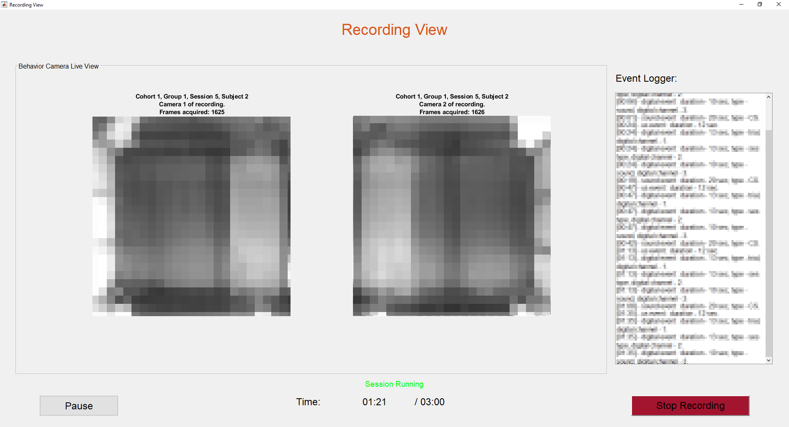

# Conducting sophisticated Fear Conditioning, Active Avoidance and other Experiments with a Single Software 

This repository is meant to control fear conditioning (FC), active avoidance (AA) or other experimental setups. The software was developed in the lab of [Benjamin Grewe](https://www.ini.uzh.ch/people/bgrewe). The code allows a simple way to design and run complex real-time experiments and record for multiple subjects in parallel; all controlled and aligned with a single computer. It also contains an expressive evaluation pipeline for FC experiments to automatically evaluate the outcome of an experiment once the data is acquired.

## Installation

The software is developed in Matlab (tested with Matlab R2017b). It makes use of several toolboxes, such as the [Image Acquisition Toolbox](https://ch.mathworks.com/products/imaq.html) and the [Data Acquisition Toolbox](https://ch.mathworks.com/products/daq.html).

Before running the programs, make sure that all the **required libraries** are downloaded and stored in the folder [lib](lib). A list of all required libraries and their download links are provided in the [lib](lib) folder.

## Documentation

More documentation is provided in the folder [docs](docs). The code is well documented and should be straight-forward to use by users, that are familiar with Matlab. After reading the documentation, one should start by exploring the repository (just opening files and reading their docstrings). Additional documentation can be requested from <henningc@ethz.ch>.

## Experimental Setup

In this section, we briefly describe the experimental setup for which the software was designed and tested. More extensive documentation can be requested from <henningc@ethz.ch>.

Most importantly, the software expects a data acquisition solution from [NI](http://www.ni.com/data-acquisition/) (NIDAQ). Such a NIDAQ board essentially controls all the stimuli presented to the subjects during an experiment.

The software also allows an easy recording of the behavior expressed by the subjects, by using one or multiple *behavior cameras*. Currently, the setup has been tested with two camera types: [Allied Vision Guppy PRO F125B](https://www.alliedvision.com/en/products/cameras/detail/Guppy%20PRO/F-125.html) and [ImagingSource DMK 23FV024](https://www.theimagingsource.com/products/industrial-cameras/firewire-800-monochrome/dmk23fv024/). Both are used as behavior cameras in our setups.

For both setups, we use foot shockers and test cages from [Coulbourn](https://www.coulbourn.com). However, this is in principle arbitrary. For the AA setup, we needed to develop a dedicated piece of hardware, in order to react in realtime. Though, this hardware should be general enough to adapt to other scenarios as it is fully programmable.

## Terminology

To control a complex experiment, one has to generate a design file, that adheres a certain format. In connection to this design file, there are many terms that are used throughout the repository, that are essential to understand in order to use the code. A design file distinguishes between *cohorts*, *groups*, *sessions* and *subjects*. A tuple of (*cohort*, *group*, *session*, *subject*) uniquely identifies a *recording*.

For instance, *subject* 2 in *session* 3 from *cohort* 1, *group* 2 specifies a single *recording*, i.e., the design files fully defines what stimuli are presented and when and how long the behavior is going to be recorded. 

## Repository Structure

This is a list of folders belonging to the repository and their main purpose.
* **control**: Contains the code to control the setup.
* **evaluation**: Contains the evaluation pipeline for an experiment.
* **experiments**: Contains example experiments conducted with the software (most importantly, their *design file generation* scripts).
* **lib**: External libraries.
* **misc**: Several useful tools (e.g., video postprocessing).

We now provide a detailed explanation for some of the above folders.

### Control

The setup is controlled by the [run_experiment](control/run_experiment.m) script in the folder [control](control). The control software provides a user-friendly way to conduct an experiment. Its focus lays on **ensuring the correct timing of all stimuli, such that they can be precisely aligned with neural recordings**.

An experiment is configured via [params.m](control/params.m) in the same folder. Recordings can either be controlled by a design file or generated ad-hoc (note, automatically generated design files only allow very simplistic designs).

Here is a short summary of the main features currently implemented (June 24th, 2018):
* Capability to run multiple recordings in parallel
* Direct control of behavior cameras including camera preview
* Ad-hoc design generation
* Recordings can be run in NIDAQ continuous mode
* Sounds can be played via the NIDAQ board or via the soundcard (in which case one can record them to correct timing afterwards)
* Recordings can be started via an external trigger
* Arbitrary trigger signals can be generated
* Sessions can be paused and terminated

### Experiments
All experiment related scripts should be in the folder [experiments](experiments). The subfolders contain code specific to an experiment, including how to generate the design file. Note, that some experiments may use outdated design file formats. One can always check the design file format via the script [check_design_file](misc/experiment_design/check_design_file.m). In the folder [experiments/examples](experiments/examples) are examples specifically designed to make new users familiar with the design file programming. 

### Evaluation
Preliminary evaluation scripts are available in the folder [evaluation](evaluation). **Note**, we currently provide only code for FC experiments. The provided evaluation pipeline only looks at the animals behavior.

The evaluation code requires that freezing traces have been extracted beforehand. The freezing detection software is currently hosted in another repository *FreezingDetection*. To get access to our freezing detection pipeline, please contact <henningc@ethz.ch> or <behret@ethz.ch>.

### Misc

This folder contains a collection of useful scripts. To name just a few:
* `misc/active_avoidance`: Specifications and example implementations of the hardware designed to allow active designs.
* `misc/behavior_cameras/postprocessing`: A tool to postprocess behavior videos (e.g., compress them).
* `misc/behavior_cameras/annotation`: Annotate behavior videos with events from the design file (only supports FC experiments).
* `misc/experiment_design/check_design_file.m`: A script to check whether a design file adheres the correct format.
* `misc/measure_soundlevel`: A tool to measure the sound pressure level (SPL) via a computer soundcard using speakers and microphone.
* `misc/sound_generation`: Scripts to generate or play tones (can be used to adjust SPL of speakers).

## Design File

The design file is one of the most important aspects, as it completely defines the experimental design. It therefore is used to control the setup and to control the evaluation.

The design file itself is a file named `experiment.mat`, that contains a variable `experiment`.

The design file is the only piece that a user has to contribute to control its experiment with this software collection. It adheres a certain format that can be checked via the script [check_design_file](misc/experiment_design/check_design_file.m).

The design file is contained in the design folder (which may incorparate other files that are referenced in the design file via relative paths (e.g., sound files)). The experiment is designed in a tree structure (where edges may be multi-edges). The first level are *cohorts*, which themselves split into *groups* (one may also think of groups and subgroups). These are divided into *sessions*, which are split into *subjects*.

Please run the script [experiments/examples/fear_conditioning/generate_fc_design_file.m](experiments/examples/fear_conditioning/generate_fc_design_file.m) to generate an example design folder. The script expects an output folder name as argument. Please explore the resulting `experiment.mat` file (it also generates a JSON file with the same content, in case this is easier to read).

A detailed explanantion of design file format can be found in the [docs](docs) folder.
